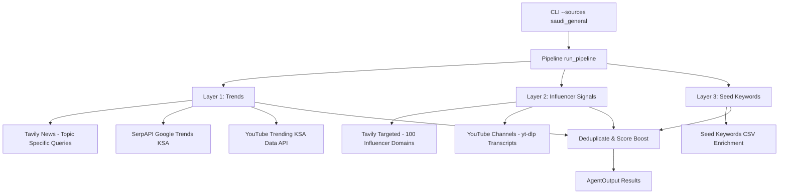

# Implementation Plan: Topic Discovery Redesign (v0.5.0)

This redesign implements a **3-layer topic discovery pipeline**: Trends first → mix with influencer signals → enrich with seed keywords. It also fixes the broken pytrends (using SerpAPI) and generic Tavily queries.

## Architecture: 3-Layer Pipeline



## Data & Configuration

### [MODIFY] [models.py](src/models.py)
- **TrendSource**: Add `SERP_TRENDS`, `INFLUENCER`, `SEED_KEYWORD`.
- **TopicOrigin**: New enum (`TREND`, `INFLUENCER`, `SEED_KEYWORD`).
- **Trend**: Add `origin: TopicOrigin = TopicOrigin.TREND` field.

### [MODIFY] [config.py](src/config.py)
- **serpapi_api_key**: str
- **seed_keywords_sources**: str = "seed_keywords"
- **influencer_scan_enabled**: bool = True

### [MODIFY] [pyproject.toml](pyproject.toml)
- Add `google-search-results>=2.4.2` (SerpAPI client).
- Remove `pytrends` (broken/unreliable for KSA endpoint).

### [NEW] [seed_keywords.csv](sources/seed_keywords.csv)
Initial brand pillars/SEO seeds:
```csv
vertical,keyword,intent,label
tech,AI in Saudi Arabia,informational,Core content pillar
tech,Saudi startups funding,informational,Startup ecosystem
finance,Tadawul stocks analysis,commercial,Finance pillar
marketing,social media marketing Saudi,commercial,Marketing pillar
ecommerce,e-commerce growth KSA,informational,E-commerce pillar
culture,Riyadh entertainment events,navigational,Culture & events
```

---

## Scanners & Pipeline

### Layer 1: Trends ([trend_scanner.py](src/trend_scanner.py))
- **Tavily Query Fix**: Use list of diverse queries (Saudi tech news, Saudi business today, etc.) instead of generic "trending topics".
- **SerpAPI Scanner**: `scan_serpapi_trends()` with `engine=google_trends` and `geo=SA`.
- **YouTube Trending**: Ensure `scan_trending_ksa` (YouTube Data API v3) runs during full scans.

### Layer 2: Influencer Signals ([influencer_scanner.py](src/influencer_scanner.py))
- **Tavily Targeted**: Search `"latest news this week"` (NOT generic trending topics) with `include_domains` locked to domains from `saudi_general.csv`.
- **YouTube Influencers**: Reuse `yt_scanner.scan_youtube_sources()`, override `origin` to `INFLUENCER`.

### Layer 3: Seed Enrichment ([seed_scanner.py](src/seed_scanner.py))
- Load keywords from `seed_keywords.csv` via `source_manager.py`.
- Run Tavily searches for each ("latest [keyword] KSA") to find fresh news context.

### Topic Mixer ([pipeline.py](src/pipeline.py))
- Run all 3 layers, passing `source_names` through.
- Implement `deduplicate_and_score()`: normalize titles, group by normalized key. Topics appearing in **2+ distinct origin layers** (TREND, INFLUENCER, SEED_KEYWORD) get `jack_potential += 0.1` capped at `1.0`. Return sorted by `jack_potential` descending.

---

## Phase Order

| Phase | Scope |
|:--|:--|
| 1 | Models & Config |
| 2 | CLI `--sources` flag *(do this before pipeline wiring)* |
| 3 | Trend Discovery fixes (Tavily queries, SerpAPI, YouTube always-on) |
| 4 | Influencer Signal Scanner (`influencer_scanner.py`) |
| 5 | Seed Keyword Enrichment (`seed_scanner.py`) |
| 6 | Topic Mixer & Scoring in `pipeline.py` |

> [!IMPORTANT]
> Phase 2 (CLI flag) must be done before Phase 6 (pipeline wiring) so `source_names` has an entry point.

## CLI Integration ([cli.py](src/cli.py))
- Add `--sources` flag to `scan`, `generate`, and `video` commands (Phase 2).
- Default to `settings.default_sources` when not specified.
- Pass `source_names=[sources]` to `run_pipeline()` and `scan_trends()`.
